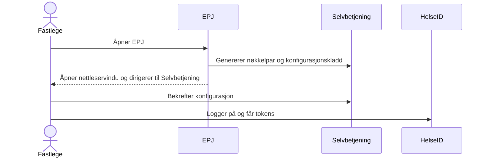
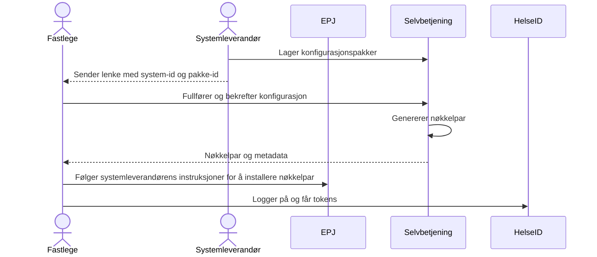
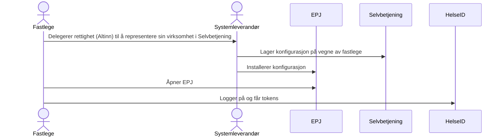

# For systemleverandører med tykklienter

En tykklient er en applikasjon med programvare som kjører lokalt på sluttbrukerens datamaskin. En slik applikasjon forutsetter en individuell konfigurasjon for å kunne fungere som en HelseID-klient.

For enkelte brukere kan det være krevende å sette opp en klientkonfigurasjon i Selvbetjening for HelseID.

- Først må man velge riktig versjon av system/fagapplikasjon
- Deretter må man vite hvilke tjenester fagapplikasjonen integrerer mot og hvilke scopes som er nødvendig
- Nøkkelpar må genereres og senere fornyes

Dette kan være utfordrende for sluttbrukere uten inngående kjennskap til hvordan disse detaljene henger sammen i et større bilde.

Derfor vil Selvbetjening for HelseID her presentere 3 alternativer for å redusere kompleksiteten for sluttbrukerne.

[Helautomatisering](#alternativ-1-anbefalt-helautomatisering-via-api) (anbefalt) og [manuell bistand](#alternativ-3-helmanuell-bistand-fra-systemleverandør) er ytterpunktene, med [delvis automatisering ved hjelp av pakkekonfigurasjon](#alternativ-2-delvis-automatisering-ved-hjelp-av-pakkekonfigurasjon) som en mellomting.

*For enkelhets skyld omtales en kunde som en fastlege, og et system/fagapplikasjon som EPJ. Dette er eksempler.*

## Alternativ 1 (anbefalt): Helautomatisering via API

Dette alternativet medfører integrasjon mot Selvbetjenings API, og dermed kodeendring fra systemleverandørens side.

Her blir all kompleksitet håndtert "under panseret" i EPJ-en, slik at fastlegen kun trenger å bekrefte konfigurasjonen i Selvbetjening for HelseID.

EPJ-en vil automatisk håndtere oppdatering av nøkkelpar ved utløp av gyldighet.

[Opprettelse av klientkonfigurasjoner via API er dokumentert her](../README.md)

## Alternativ 2: Delvis automatisering ved hjelp av pakkekonfigurasjon

> **_MERK:_** Pakkekonfigurasjon er under utvikling, og er derfor ikke tilgjengelig i Selvbetjening for HelseID ennå.

Dette alternativet medfører ingen kodeendring hos systemleverandøren.

Systemleverandøren konfigurerer én eller flere "pakker" av api scopes i Selvbetjening. Hver av disse pakkene vil ha en id, som kan refereres i en lenke systemleverandøren sender til fastlegen. Du kan sette opp pakker under fanen "pakker" på klientsystemet i Selvbetjening.

Ved bruk av denne lenken vil EPJ, tjenester og scopes være konfigurert på forhånd i Selvbetjening for HelseID.

Fastlegen må manuelt håndtere nøkkelpar i selvbetjeningsløsningen. Dette gjøres ved å laste ned en kryptert konfigurasjonsfil som inneholder nøkkelpar.

Systemleverandøren må lage en steg-for-steg-veiledning som forklarer hvordan fastlegen kan angi klient-id og nøkkelpar i sin EPJ-installasjon.

### Utløp av nøkkelparets gyldighet

I god tid før nøkkelparets gyldighet løper ut, må fastlegen logge inn i Selvbetjening og generere et nytt nøkkelpar. Dette må deretter angis i EPJ-installasjonen. Hvis dette ikke gjøres tidsnok, vil det føre til driftsstans for EPJ-installasjonen, fordi HelseID-integrasjonen vil feile ved utløpt nøkkelpar.

**Merk**: Selvbetjenings-API-et har et eget endepunkt for å oppdatere nøkkelpar, uten at systemleverandøren trenger å implementere den fulle flyten beskrevet i [alternativ 1](#alternativ-1-helautomatisering-via-api). En integrasjon begrenset til nøkkelpar vil medføre en liten, og svært enkel, kodeendring for systemleverandøren. En slik integrasjon vil bety at fastlegen bare trenger å logge inn i Selvbetjening én gang, ved førstegangsoppsett, og generere nøkkelpar manuelt. Deretter håndteres nøkkelparvedlikeholdet automatisk og sømløst.

[Oppdatering av nøkkelpar via API er dokumentert her](../README.md#updating-the-client)

## Alternativ 3: Helmanuell bistand fra systemleverandør

Systemleverandøren setter opp en klientkonfigurasjon på vegne av fastlegens virksomhet, og konfigurerer EPJ-installasjonen som nødvendig.

For at systemleverandøren skal kunne opptre på fastlegevirksomhetens vegne, må sistnevnte delegere rettighet via Altinn: [Dokumentert her](https://helseid.atlassian.net/wiki/spaces/HELSEID/pages/526876673/Delegering+fra+virksomhet+til+virksomhet)

Systemleverandøren må holde styr på når nøkkelparets gyldighet utløper, og hjelpe fastlegen med å få tatt det i bruk.

